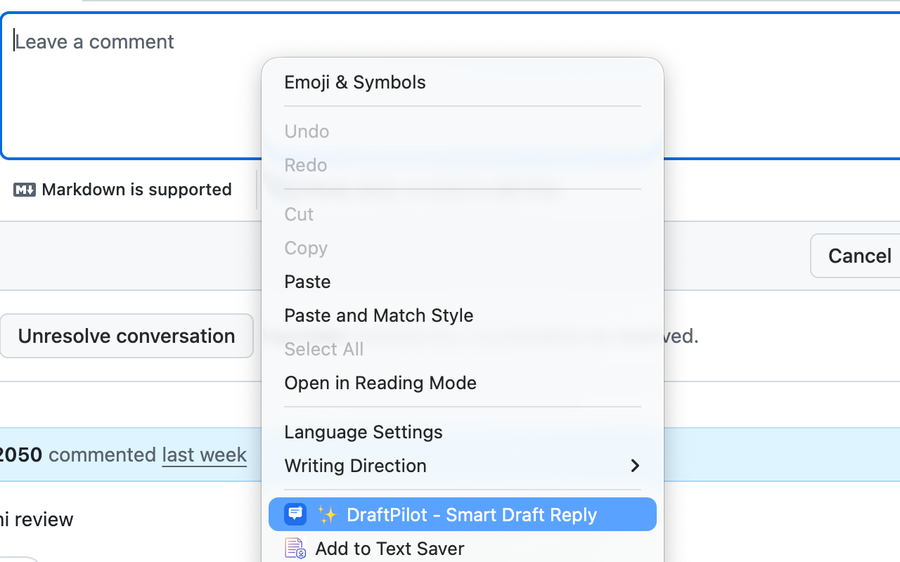
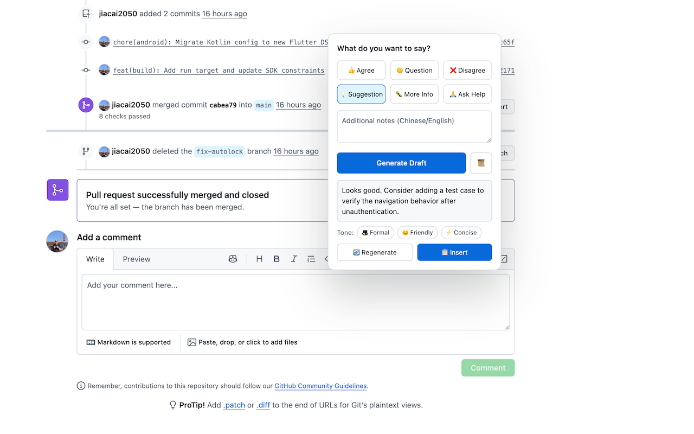

# DraftPilot

A Chrome extension that helps non-native English speakers write professional English replies on any website. Deeply optimized for GitHub issues and PRs.

## Features

- **Intent-based drafting** — Pick from 6 presets (agree, question, disagree, suggestion, info, help) or type your own notes in any language
- **Context-aware** — Automatically identifies reply target (selected text > comment container > page context)
- **GitHub deep integration** — Extracts issue/PR title, body, and comments (DOM extraction + GitHub API fallback)
- **Universal support** — Works in any text input on Gmail, Slack, forums, and more
- **Tone adjustment** — Rewrite drafts as Formal, Friendly, or Concise after generation
- **Draft history** — Stores your last 20 drafts locally
- **Any OpenAI-compatible API** — Works with OpenAI, Anthropic, Cloudflare AI Gateway, DeepSeek, Groq, local Ollama, etc.

## Screenshots

<div align="center">


</div>

## Installation

1. Clone or download this repository
2. Open `chrome://extensions` in Chrome
3. Enable **Developer mode** (top-right toggle)
4. Click **Load unpacked** and select the `draft-pilot` directory
5. Click the DraftPilot icon in the toolbar to configure your API key

## Setup

1. Click the extension icon to open Settings
2. Select your **API Provider** (OpenAI Compatible or Anthropic)
3. Set **API Base URL** if using a custom endpoint (e.g. `https://api.deepseek.com/v1`), leave empty for default (OpenAI: `https://api.openai.com/v1`, Anthropic: `https://api.anthropic.com`)
4. Enter your **API Key**
5. Model can be left empty, defaults to `gpt-4o` (OpenAI Compatible) / `claude-sonnet-4-20250514` (Anthropic)
6. Optionally set a default tone and GitHub Token
7. Click **Save**

### GitHub Token (Optional)

DraftPilot extracts issue context from the page DOM. If that fails (e.g. GitHub changes their UI), it falls back to the GitHub API. For public repos no token is needed. For private repos, provide a [Personal Access Token](https://github.com/settings/tokens) with `repo` scope.

## Usage

1. Navigate to any GitHub issue or PR page
2. Click into the comment textarea
3. **Right-click** → select **✨ DraftPilot - Smart Draft Reply**
   - Or press `Cmd+Shift+E` / `Ctrl+Shift+E`
4. Select an intent and/or type additional notes
5. Click **生成草稿** (Generate Draft)
6. Edit the draft if needed, adjust tone, or regenerate
7. Click **📋 插入输入框** (Insert) to fill the comment box
8. Review and submit using GitHub's native button

### Context Detection

DraftPilot automatically identifies what you're replying to, in this priority:

1. **GitHub-specific** — On GitHub pages, automatically extracts selected text / comment container content / issue/PR title, body, and recent comments (DOM extraction + GitHub API fallback)
2. **Selected text** — If you select text on the page before triggering, that selection is used as context (most precise)
3. **Page content extraction** — Uses Readability.js to intelligently extract the main content of the current page (works for email, forums, etc.)

## Keyboard Shortcut

| Platform      | Shortcut           |
| ------------- | ------------------ |
| macOS         | `Cmd + Shift + E`  |
| Windows/Linux | `Ctrl + Shift + E` |

To customize, open `chrome://extensions/shortcuts` in your browser and find DraftPilot.

## Privacy

- Your API key and GitHub token are stored locally in `chrome.storage.local` only
- No data is sent to any server other than your chosen LLM provider and GitHub API
- No telemetry or analytics

## Project Structure

```
draft-pilot/
├── manifest.json          # Manifest V3 config
├── shared/
│   └── storage.js         # Storage helper (ES module)
├── content/
│   ├── github.js          # Issue/PR context extraction (DOM + API fallback)
│   ├── ui.js              # Popover UI rendering
│   └── content.js         # Right-click & shortcut trigger
├── background/
│   └── service-worker.js  # LLM API calls & GitHub API
├── popup/
│   ├── popup.html         # Settings page
│   └── popup.js
├── styles/
│   └── content.css        # Injected styles
└── icons/
    ├── icon-16.png
    └── icon-48.png
```

## License

MIT
