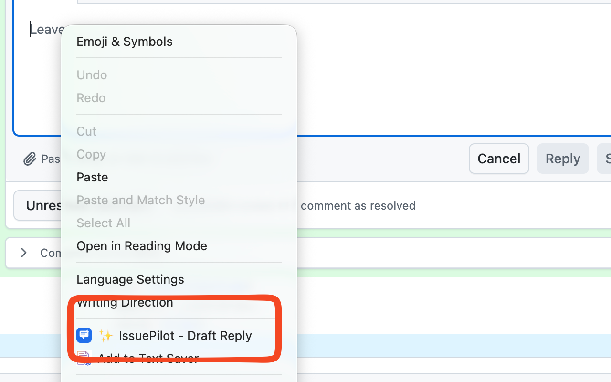

# IssuePilot

一个帮助非英语母语开发者在 GitHub issue 和 PR 中撰写地道英文评论的 Chrome 扩展。

## 功能特性

- **意图驱动** — 6 个预设意图（赞同、有疑问、反对、有建议、补充信息、求助）+ 自由输入（中英文均可）
- **上下文感知** — 自动读取 issue 标题、正文和最近评论（DOM 提取 + GitHub API 兜底）
- **语气微调** — 生成后可一键切换为正式、友好或简洁风格
- **草稿历史** — 本地保存最近 20 条草稿
- **主题适配** — 跟随 GitHub Light/Dark 主题
- **兼容任意 OpenAI 格式 API** — 支持 OpenAI、Anthropic、Cloudflare AI Gateway、DeepSeek、Groq、本地 Ollama 等

## 截图

<div align="center">


</div>

## 安装

1. 克隆或下载本仓库
2. Chrome 打开 `chrome://extensions`
3. 开启右上角 **开发者模式**
4. 点击 **加载已解压的扩展程序**，选择 `issue-pilot` 目录
5. 点击工具栏中的 IssuePilot 图标进行配置

## 配置

1. 点击扩展图标打开设置页
2. 选择 **API Provider**（OpenAI Compatible 或 Anthropic）
3. 设置 **API Base URL**（如 `https://api.deepseek.com/v1`），留空使用默认值（OpenAI: `https://api.openai.com/v1`，Anthropic: `https://api.anthropic.com`）
4. 输入 **API Key**
5. Model 可留空，默认使用 `gpt-4o`（OpenAI Compatible）/ `claude-sonnet-4-20250514`（Anthropic）
6. 可选设置默认语气和 GitHub Token
7. 点击 **保存**

### GitHub Token（可选）

IssuePilot 优先从页面 DOM 提取 issue 上下文。如果提取失败（如 GitHub 更新了 UI），会自动通过 GitHub API 获取。公开仓库无需 Token，私有仓库需要提供一个具有 `repo` 权限的 [Personal Access Token](https://github.com/settings/tokens)。

## 使用方法

1. 打开任意 GitHub issue 或 PR 页面
2. 点击评论输入框
3. **右键** → 选择 **✨ IssuePilot - Draft Reply**
   - 或按快捷键 `Cmd+Shift+E` / `Ctrl+Shift+E`
4. 选择意图 和/或 输入补充说明
5. 点击 **生成草稿**
6. 可直接编辑草稿、调整语气或重新生成
7. 点击 **📋 插入输入框** 将草稿填入评论框
8. 确认无误后用 GitHub 原生按钮提交

## 快捷键

| 平台          | 快捷键             |
| ------------- | ------------------ |
| macOS         | `Cmd + Shift + E`  |
| Windows/Linux | `Ctrl + Shift + E` |

如需自定义快捷键，打开 `chrome://extensions/shortcuts` 找到 IssuePilot 修改即可。

## 隐私

- API Key 和 GitHub Token 仅存储在本地 `chrome.storage.local`
- 除你选择的 LLM 服务和 GitHub API 外，不会向任何服务器发送数据
- 无遥测、无分析

## 项目结构

```
issue-pilot/
├── manifest.json          # Manifest V3 配置
├── shared/
│   └── storage.js         # 存储工具（ES module）
├── content/
│   ├── github.js          # Issue/PR 上下文提取（DOM + API 兜底）
│   ├── ui.js              # Popover UI 渲染
│   └── content.js         # 右键菜单 & 快捷键触发
├── background/
│   └── service-worker.js  # LLM API 调用 & GitHub API
├── popup/
│   ├── popup.html         # 设置页
│   └── popup.js
├── styles/
│   └── content.css        # 注入样式
└── icons/
    ├── icon-16.png
    └── icon-48.png
```

## License

MIT
