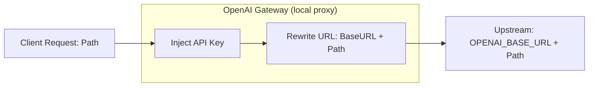

# OpenAI Gateway

A tiny (~40 lines) Go reverse proxy for the OpenAI API. It injects your API key server-side so clients never need to hold credentials.

> Pairs great with [OpenClaw](https://openclaw.ai/) 🦞.

## Features

- **Auth injection**: Adds `Authorization: Bearer <OPENAI_API_KEY>` to every request automatically.
- **Transparent proxying**: Forwards requests to `OPENAI_BASE_URL` with the original path intact.
- **Streaming**: Full pass-through support for OpenAI streaming responses.

## How It Works



## Quick Start

### 1. Run

```bash
# Required: your real OpenAI API key
export OPENAI_API_KEY="sk-..."

# Optional: override the upstream URL (default: https://api.openai.com/v1)
# export OPENAI_BASE_URL="https://api.openai.com/v1"

go run main.go
```

### 2. Connect a Client

#### OpenAI Python SDK

Since the gateway handles auth, clients just need to point `base_url` at the gateway. The `api_key` value is ignored — pass anything.

```python
from openai import OpenAI

client = OpenAI(
    base_url="http://localhost:8080",
    api_key="local-proxy"
)

response = client.chat.completions.create(
    model="gpt-3.5-turbo",
    messages=[{"role": "user", "content": "Hello via Gateway!"}]
)
print(response.choices[0].message.content)
```

#### curl

```bash
# Proxied to {OPENAI_BASE_URL}/chat/completions
curl http://localhost:8080/chat/completions \
  -H "Content-Type: application/json" \
  -d '{"model": "gpt-3.5-turbo", "messages": [{"role": "user", "content": "Hi!"}]}'

# Proxied to {OPENAI_BASE_URL}/models
curl http://localhost:8080/models
```
