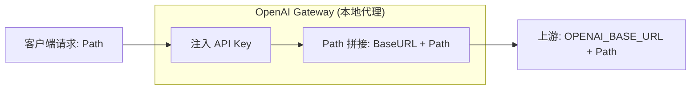

# OpenAI Gateway

一个用 Go 编写的极简 OpenAI API 透明代理（代码 40 行），支持自动注入 API Key，解决 API Key 泄露风险。

> 配合[龙虾](https://openclaw.ai/)🦞食用最佳。

## 核心特性

- **身份认证**: 为所有请求自动注入 `Authorization: Bearer <OPENAI_API_KEY>`。
- **透明转发**: 保持请求路径完整并拼接到 `OPENAI_BASE_URL` 之后。
- **流式支持**: 完美透传 OpenAI 的 Streaming 响应。

## 工作流



## 快速开始

### 1. 运行
```bash
# 必须：设置你的真实 OpenAI API Key
export OPENAI_API_KEY="sk-..."

# 可选：修改上游地址，默认 https://api.openai.com/v1
# export OPENAI_BASE_URL="https://api.openai.com/v1"

go run main.go
```

### 2. 客户端配置

#### OpenAI Python SDK
网关已自动注入真实 API Key，你在客户端只需将 `base_url` 指向本地网关，并传入一个任意值的 `api_key` 即可。

```python
from openai import OpenAI

client = OpenAI(
    base_url="http://localhost:8080",
    api_key="local-proxy"
)

response = client.chat.completions.create(
    model="gpt-3.5-turbo",
    messages=[{"role": "user", "content": "Hello via Gateway!"}]
)
print(response.choices[0].message.content)
```

#### Curl 测试
```bash
# 请求 /chat/completions，转发至 {OPENAI_BASE_URL}/chat/completions
curl http://localhost:8080/chat/completions \
  -H "Content-Type: application/json" \
  -d '{"model": "gpt-3.5-turbo", "messages": [{"role": "user", "content": "Hi!"}]}'

# 请求 /models，转发至 {OPENAI_BASE_URL}/models
curl http://localhost:8080/models
```
